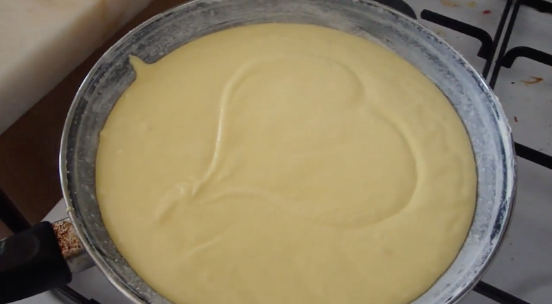

<!-- this is a markdown file -->

# :pie: **lemon cake** :gun:

:white_check_mark: vegan
:white_check_mark: gluten-free
:negative_squared_cross_mark: oil-free
:negative_squared_cross_mark: sugar-free

## **dries:**

- 1 cup **cornstarch**
- 1 cup **rice/buckwheat flour**
- 1/2 cup **almond/coconut flour**
- a pinch of **baking powder and baking soda**
- q.b. **salt**, **herbs** (thymian, ...), **spices** (ginger, kurkuma, cinnamon, ...) - exxxtras are of course opcional!

> _whisk and put aside_

## **wets:**

- 1 cup **sugar**
- 1/2 cup **veggie drink** (rice, soy)
- 1/4 **oil**
- 2 tbsp **yogurt**
- 1 tbsp ground **flax seeds**
- **lemon juice**
- (exxxtras are welcome)

> _**mix wet with the dry**, it should be veeeery wet, almost liquid. pour it on the cake tin greased with oil._

> _put inside of the preheated oven on 180 degrees. check it with a fork after 30 mins or so. then proceed to take it out when the fork comes clean._

> _wait 5 mins and de-form it and then pour the calda on top of it while it is still hot (make some holes with a fork so its better absorbed.) the calda is mostly lemon juice, veggie drink, sugar and extras._

> _top the cake with grated lemon peel and seeds (opcional)._

__E :lemon: N :lemon: J :lemon: O :lemon: Y__

this recipe was created by [Milo Silveira](https://www.instagram.com/biliciqueta/)

full process on [Youtube](https://youtu.be/qLf9mowslkk)
